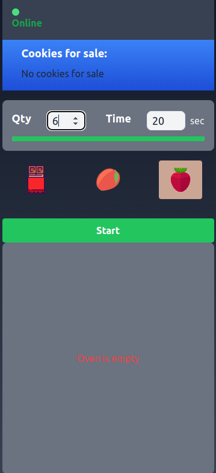
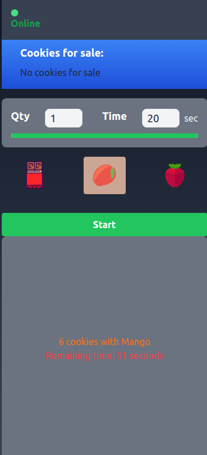
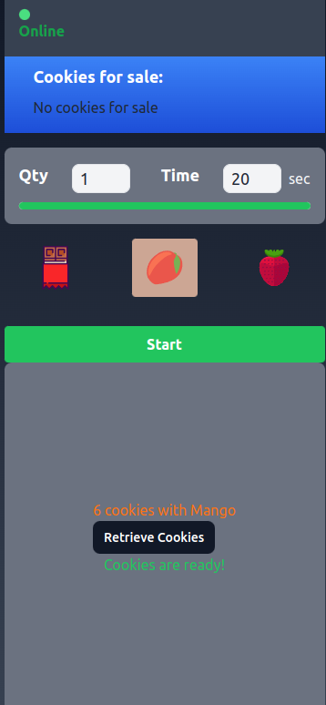
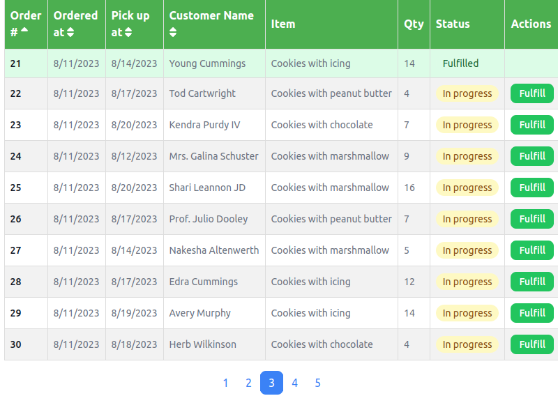
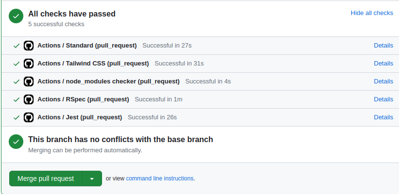

# Digital Bakery

## Screenshots

  
  
  

Digital Bakery is a modern web application built using Rails, React, and Vite, showcasing the seamless integration of client-side development with the power of server-side rendering. The application is designed to simulate the experience of running a bakery, where users can place and fulfill orders for digital cookies.

## Features

- **Real-time Baking Progress:** Witness the magic of modern web technologies with Hotwire, Stimulus, and Vite. The application showcases the dynamic nature of baking, allowing you to experience the entire process in real-time as the cookies go through preparation, baking, and fulfillment. Thanks to Turbo Streams and Turbo Frames, only the relevant parts of the page update, providing a fluid user experience.

- **Order Management:** React comes into play for managing orders. The Orders section allows you to view, sort, and track the status of each order. You'll know exactly when an order is in progress or has been fulfilled, enhancing your bakery management experience.

- **Responsive Design:** The user interface is beautifully crafted using Tailwind CSS, ensuring a responsive and visually appealing design across various devices. Whether you're on a desktop, tablet, or smartphone, Digital Bakery adapts seamlessly.

## How to Run

1. Clone this repository to your local machine.
2. Install the required dependencies using `bundle install` and `yarn install`.
3. Start the application using `bin/dev`.
4. Open your web browser and visit [http://localhost:3000](http://localhost:3000) to experience the Digital Bakery.

## GitHub Actions

The power of modern development practices is showcased through GitHub Actions. Pull request triggers a series of automated checks, including linting, RSpec tests, and Jest tests. This ensures that the codebase remains consistent, and potential issues are caught early in the development process.

## Conclusion

Thank you for exploring the Digital Bakery application. I have leveraged the latest web technologies to create a seamless and immersive user experience in the world of digital cookies. This project demonstrates omy expertise in working with Rails, React, Hotwire, Stimulus, Tailwind CSS, and Vite. As I continue to enhance the Digital Bakery, I look forward to tackling new challenges and delivering innovative solutions.

Warm regards,
Dejan
