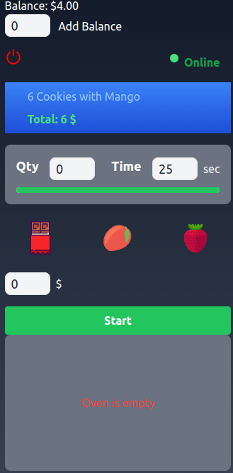
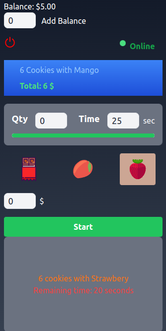
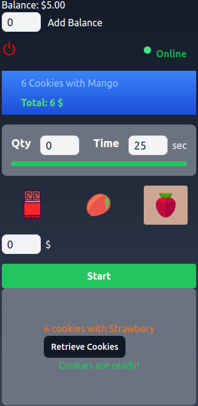

# Cookies Vending Machine

## Screenshots

 |  | 
:-------------------------:|:-------------------------:|:-------------------------:
Vending Machine 1           | Vending Machine 2           | Vending Machine 3

The Cookies Vending Machine is a cutting-edge web application created using a combination of Rails, React, and Vite. This innovative project showcases the fusion of server-side rendering with the prowess of client-side development. The application simulates the experience of interacting with a digital vending machine where users can purchase various cookies with different toppings.

## Features

### Interactive Vending Experience

Powered by a blend of React, Hotwire, Stimulus, and Vite, the Vending Machine provides a dynamic and engaging experience. Users can witness the entire process in real-time as they select their desired cookies, add toppings, and see the virtual vending machine respond accordingly. Turbo Streams and Turbo Frames ensure that only the relevant parts of the page are updated, resulting in a seamless and fluid user journey.

### Cookie Purchases and Balance Management

Leveraging React, the application enables users to buy cookies from the vending machine. If the user has sufficient funds in their balance, they can purchase one or more cookies with different toppings. The cost of each cookie is deducted from the user's balance. The vending machine can be toggled on and off. When turned off, cookie purchases are disabled.

### Responsive and Visually Appealing Design

The user interface, designed with Tailwind CSS, is not only visually appealing but also responsive across various devices. Regardless of whether users access the application on a desktop, tablet, or smartphone, the interface adapts seamlessly.

## How to Operate

1. Clone the repository to your local machine.
2. Install the necessary dependencies using `bundle install` and `yarn install`.
3. Launch the application with the command `bin/dev`.
4. Open your web browser and navigate to [http://localhost:3000](http://localhost:3000) to experience the Cookies Vending Machine.

## GitHub Actions Integration

The potency of contemporary development practices is exemplified through GitHub Actions. Pull requests trigger an automated workflow encompassing linting, RSpec tests, and Jest tests. This approach guarantees codebase consistency and the early identification of potential issues during the development cycle.

## Conclusion

Thank you for exploring the Cookies Vending Machine application. I've harnessed the latest web technologies to create an immersive and captivating user experience centered around digital cookie purchases. This endeavor showcases my proficiency in working with Rails, React, Hotwire, Stimulus, Tailwind CSS, and Vite. As I continue to enhance the Cookies Vending Machine, I eagerly anticipate conquering fresh challenges and delivering ingenious solutions.

Warm regards,
@DevuDeveloper

